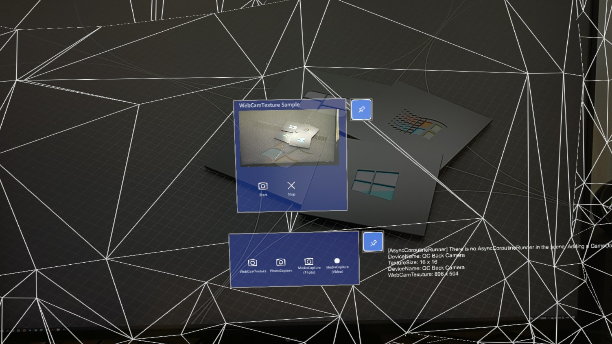

# HoloLensCameraSample

## 概要

以下に示す HoloLens のカメラ実装サンプルです。MRTK の SceneSystem を利用しているため1つのアプリで全てのサンプルシーンの動作確認が可能です

### WebCamTextureSample シーン

- WebCamTexture を利用したカメラプレビューのサンプル

  - Unityエディター上から、Webカメラでも動作確認可能です

### PhotoCaptureSample シーン

- PhotoCapture を利用したフォトキャプチャのサンプル

  - Unityエディター上から、Webカメラでも動作確認可能です

  - HoloLens 2 実機だと 3904 x 2196 のサイズでしかキャプチャ出来ないようです

  - 生のバイト列を操作する例として、グレースケール化する画像処理も入れています

### MediaCapturePhotoSample シーン

- MediaCapture を利用したフォトキャプチャのサンプル

  - 上記 PhotoCapture と異なり様々なサイズのキャプチャが可能です

### MediaCaptureVideoSample シーン

- MediaCapture を利用したビデオキャプチャのサンプル

  - ビデオキャプチャを行いファイルに保存します

## 動作確認環境

- Unity 2019.4.27f1

- MRTK v2.7.0
